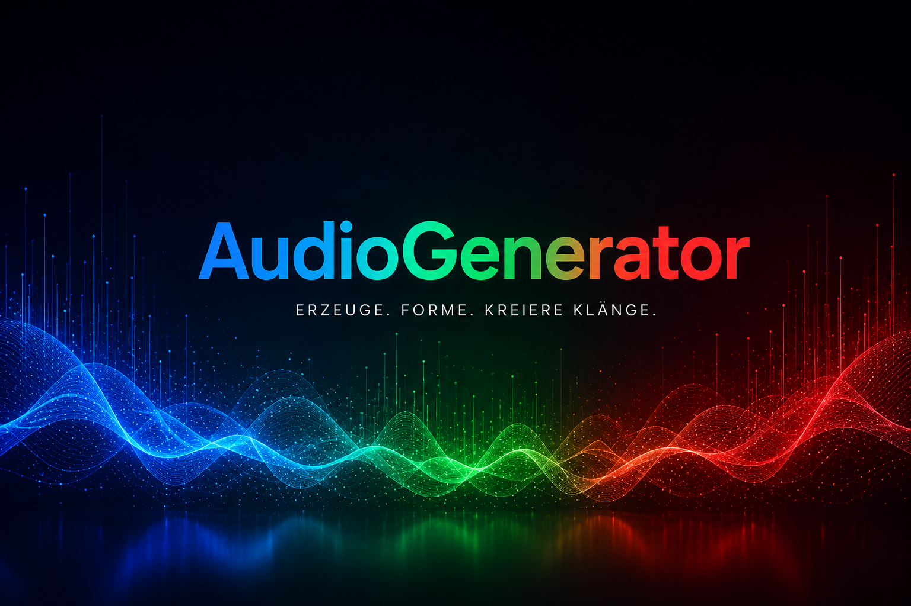

# AudioGenerator
Let's make our PC sing with syths and all there is to it.

This program lets you configure sounds you can play live. Secondary it lets you save these sounds as files.

We are using the audio library [PortAudio](https://portaudio.com/).

